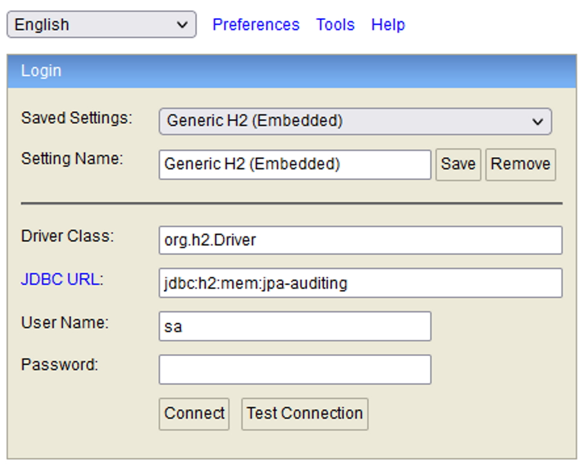
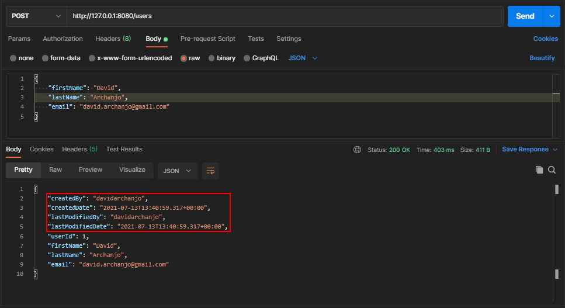
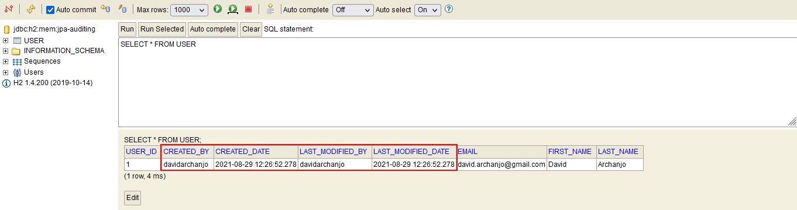
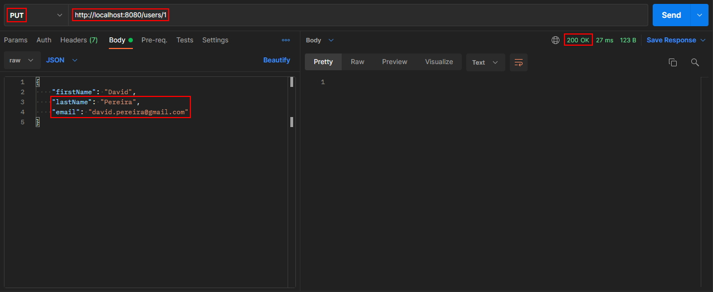
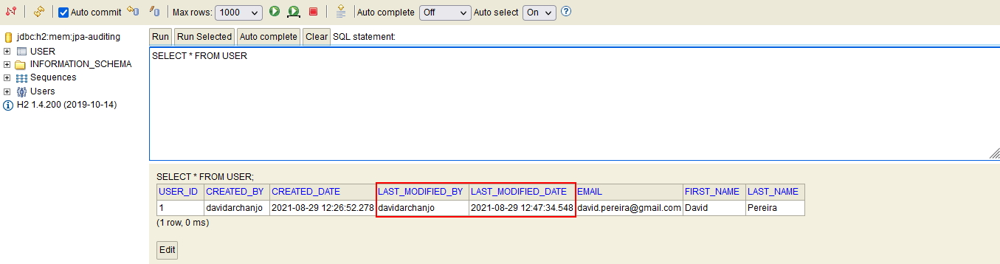

# Spring Boot + JPA Database Auditing


## Overview
[Spring Data JPA](https://spring.io/projects/spring-data-jpa) provides some set of convenient and useful annotations for database auditing. It provides a way to keep a track of **who did the change** and **when it was done**.
The auditing functionality is provided out of the box by the usage of the following four annotations:
- `@CreatedBy`
- `@CreatedDate`
- `@LastModifiedBy`
- `@LastModifiedDate`

This repository is intended to be a reference for implementing database auditing with a focus on the settings and code needed to make it work in any SpringBoot application backed by any database (as long as it is supported by Spring JPA itself). Some development best practices were not taken into account in favor of objectivity and simplicity. .


## Prerequisites
- Maven 3+
- Java 8+ 


## Tech Stack
- [Spring Boot 2.3.1.RELEASE](https://spring.io/blog/2020/06/12/spring-boot-2-3-1-available-now)
- [Spring Web MVC](https://docs.spring.io/spring-framework/docs/current/reference/html/web.html)
- [Spring Data JPA](https://spring.io/projects/spring-data-jpa)
- [H2 Database](https://www.h2database.com/html/main.html)
- [Project Lombok](https://projectlombok.org/)


## Booting Up the Application
````bash
$ mvn spring-boot:run
````
The application will be accepting request at http://localhost:8080/users, and the H2 Database Console's login page will available at http://localhost:8080/h2-console according to the screenshot below:



## Testing

With the application up and running, lets test the **JPA Auditing** capabilities. I'm using [Postman](https://www.postman.com/) for demonstration and I made available the [postman_collection](./postman_collection.json) I used so you can follow along easily. Check [here](https://learning.postman.com/docs/getting-started/importing-and-exporting-data/#importing-data-into-postman) for more information on how import a collection into Postman if needed.

- Lets create a user:
  
  
  As for the snapshots, a new user was created successfully on the database and we can check from the [H2 Console](http://localhost:8080/h2-console) the fields `CREATED_BY`, `CREATED_DATE`, `LAST_MODIFIED_BY`, `LAST_MODIFIED_DATE` were populated dynamically by JPA with auditing data. From those fields it can be verified who was responsible for creating the record and when this action happened.
  
  
- Now, lets simulate a user profile update by changing the `lastName` and `email` values from the previously created user and see what happens:
  
  
  As outlined from the [H2 Console](http://localhost:8080/h2-console), the `LAST_MODIFIED_DATE` field value has been updated, thus reflecting that the record has been modified since its creation by user `davidarchanjo`. 


## Notes
For simplicity's sake, in the [JpaAuditingConfiguration](./src/main/java/br/com/darchanjo/examples/jpa/auditing/config/JpaAuditingConfiguration.java) configuration bean I'm hard-coding the user `davidarchanjo`, as the "fake" logged user, who turns to be used by the responsible for inserting and updating data into the database. If [Spring Security](https://spring.io/projects/spring-security) is being used, we could get the real logged user's name by calling: 
```
SecurityContextHolder.getContext().getAuthentication().getName()
```
