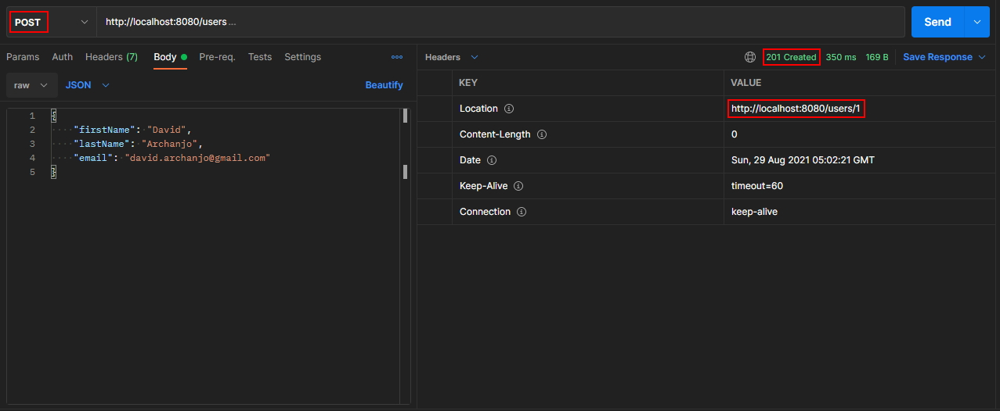

# Spring Boot + JPA Database Auditing


## Overview
[Spring Data JPA](https://spring.io/projects/spring-data-jpa) provides some set of convenient and useful annotations for database auditing. It provides a way to keep a track of **who did the change** and **when it was done**.
The auditing functionality is provided out of the box by the usage of the following four annotations:
- `@CreatedBy`
- `@CreatedDate`
- `@LastModifiedBy`
- `@LastModifiedDate`

This repository is intended to be a reference for implementing database auditing with a focus on the settings and code needed to make it work in any SpringBoot application backed by any database flavor (as long as it is supported by Spring JPA itself). Some development best practices were not taken into account in favor of objectivity and simplicity. .

## Prerequisites
- Maven 3+
- Java 8+ 


## Booting Up the Application
````bash
$ mvn spring-boot:run
````
**Note:** The application will be accepting request at `http://localhost:8080/users`


## Testing
With the application up and running, lets test the Spring JPA auditing capabilities:

- First, lets add a user:
  
  Those outlined fields are the auditing information populated dynamically by JPA. From them we can have the information about the user responsible for creating the record and the exact date and time of the action. 
  **It is important to note, in general, audit information are not transmitted in api's response payload, as it is usually for internal use only.**
  
  
- Now, lets modify the user's email and see what happen:
  
  
  Notice the date and time of the `lastModifiedDate` field was updated, thus reflecting this record was modified since its creation by the user `davidarchanjo`. 


## Disclaimer
For simplicity's sake, in the [JpaAuditingConfiguration](./src/main/java/br/com/darchanjo/examples/jpa/auditing/config/JpaAuditingConfiguration.java) config bean I'm hard-coding the user `davidarchanjo`, as the "fake" logged user responsible for inserting and updating into the database. In case you're using spring-security, you can get the current logged user's name by calling: 
```
SecurityContextHolder.getContext().getAuthentication().getName()
```
